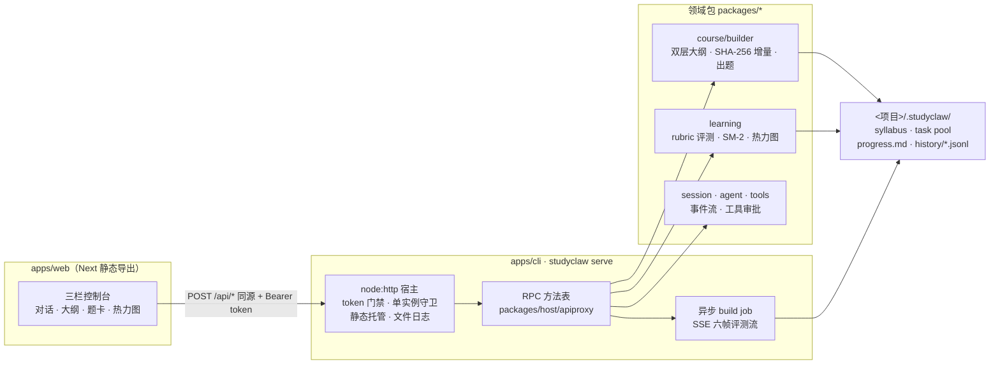

# StudyClaw

**把一个本地资料文件夹，变成一门可对话、可出题、可复习的课程。**

StudyClaw 是「项目即课程」的本地学习助手：指向一个放学习资料的文件夹，它会
摄取资料构建课程大纲与知识索引，你可以随时和 AI 辅导对话；系统基于课程内容
自动生成题卡，通过评测（rubric 判分 / 选择题本地答案键快判）驱动 SM-2 间隔
重复调度，进度、掌握度与学习热力图全部落在本地文件里——**文件即状态，不依赖
任何云端账号**。

核心特性：

- **项目即课程**：一个本地目录就是一门课程，资料就地扫描、增量构建（SHA-256
  校验，改哪补哪），状态全部写进项目内的 `.studyclaw/`。
- **对话即学习**：苏格拉底 / 快速冲刺 / 费曼输出 / 实战排错四种模式，Agent
  运行时带工具调用与审批（fail-closed），流式 SSE 渲染。
- **评测驱动**：rubric 逐采分点评判 + 选择题零 LLM 本地判分；SM-2 间隔重复
  （经典序列 1/6/15…，EF 钳制 [1.3, 2.9]），掌握度指数平滑更新。
- **可视化进度**：概念掌握度、到期队列、学习热力图（数据来自本地评测审计流）。
- **一个进程即软件**：`studyclaw serve` 同端口自带 Web UI、启动签发访问
  token、文件日志与单实例守卫齐备。
- **本地优先**：默认只绑定 `127.0.0.1`，跨站请求被 Origin 白名单拒绝；
  OpenAI 兼容端点 + API Key 凭据只存本地。

## 快速开始

运行时要求：Node `^22.19 || >=24`、pnpm（`corepack pnpm` 或任意 pnpm ≥ 9）。

```bash
# 1. 安装依赖
pnpm install

# 2. 构建 Web UI 静态产物（一次性）
pnpm build:web

# 3. 一个进程跑起来（宿主 + Web UI 同端口；--open 自动开浏览器）
pnpm serve --open
#    等价：node_modules/.bin/tsx --tsconfig tsconfig.base.json apps/cli/src/bin.ts serve --open
```

首次使用三步：**添加项目**（选资料文件夹）→ **配置模型**（设置 → 模型配置，
任意 OpenAI 兼容端点；不配置也能做选择题——本地答案键判分）→ **上传/勾选
资料**（构建后即可出题练习）。

开发模式（热更新前端）用两个终端：`pnpm serve` + `cd apps/web && npx next dev`
——dev 下 rewrites 代理 `/api`，token 由根布局从 `~/.studyclaw/host.json`
自动注入；`pnpm build:web` 后回归单进程形态。

CLI 与 Web 共用同一服务层（先 `studyclaw serve` 再用；端口与 token 从
`~/.studyclaw/host.json` 自动发现）：

```bash
studyclaw status                              # 工作区与课程总览
studyclaw sync [--course <id>]                # 触发增量构建（轮询 job 进度）
studyclaw quiz [count] [--mode new|review]    # 终端做题（评测写回同一进度）
studyclaw review [count]                      # 只出到期复习卡
studyclaw chat "解释一下 X" [--mode socratic]  # 命令行对话
```

## 发布（npm 包）

```bash
pnpm release:pack      # CLI tsdown bundle + Web 静态导出 → 合成发布清单 → npm pack
pnpm release:verify    # 把 tgz 真装一遍并运行 --help/status（"发布即坏"门禁）
pnpm release:publint   # 包结构合法性校验
```

## 布局

```
apps/
  cli/                        宿主服务 + CLI（serve/status/sync/quiz/review/chat/agent/approvals）
  web/                        Next.js Web 界面（三栏控制台；静态导出由 serve 托管）
packages/                     领域包，按 <group>/<pkg> 组织：
  storage/                    storage / storage-domain / storage-json
  workspace/ session/ tools/  工作区注册表 / 会话事件流 / 工具规格与处理器
  course/                     builder（大纲+增量构建+出题）/ summary
  learning/                   进度板/SM-2/Rubric 评测/热力图
  agent/ acp/                 通用 Agent runtime / ACP 协议
  host/                       apiproxy（RPC 边界）/ chat-service（设置/课程/会话服务）
  scripts/release/            发布流水线（pack / verify-packed-install）
vendor/                       dsh vendor 的 cordis 生态（MIT，保留原名）+ SheetJS 官方 tgz
```



## 开发

```bash
pnpm install                # 安装依赖
pnpm typecheck              # tsc -b 全图 project references
pnpm test                   # 后端测试（vitest，tsx 源码直跑，无需先构建）
cd apps/web && pnpm test    # web 测试
pnpm smoke:storage          # storage 冒烟
```

- CI：`.github/workflows/ci.yml`（typecheck + 后端/前端测试 + 发布打包安装验证 + src 误产物守卫）。
- 从 dsh（[deepseek-harness](https://github.com/deepseek-ai/deepseek-harness)）
  复用的组件与许可证见 `THIRD_PARTY_NOTICES.md`；复制的包保留 `@deepseek-ai/*`
  原名以零改动复用，本项目自有包使用 `@studyclaw/*` 作用域。
- 许可证：MIT（见 `LICENSE`）。

## 已知取舍

- 目录选择器：Windows 走 `IFileOpenDialog` 子进程、macOS 走 `osascript`、
  Linux 走 `zenity`/`kdialog`，皆不可用时自动回落服务端目录浏览。
- RPC 安全：默认只绑定 `127.0.0.1` + loopback Origin 白名单 + 启动签发的
  Bearer token（`~/.studyclaw/host.json`）；`--insecure-no-token` 为显式逃生口。
- 打包形态（`release:pack`）的 CLI bundle 内 pdfjs 无法读取 cmaps/字体目录，
  CJK PDF 抽取可能降级；源码/开发模式不受影响。
- `xlsx` 依赖固定为 SheetJS 官方 0.20.3 tgz（`vendor/tarballs/`，pnpm overrides
  统一覆盖），规避 npm 上 0.18.5 的已知 CVE。
- 评测审计写在会话事件流里；无会话时自动补一个「做题记录」会话，保证热力图
  数据完整。
