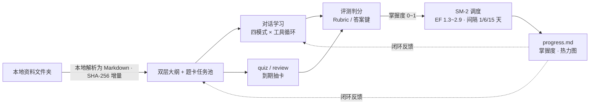
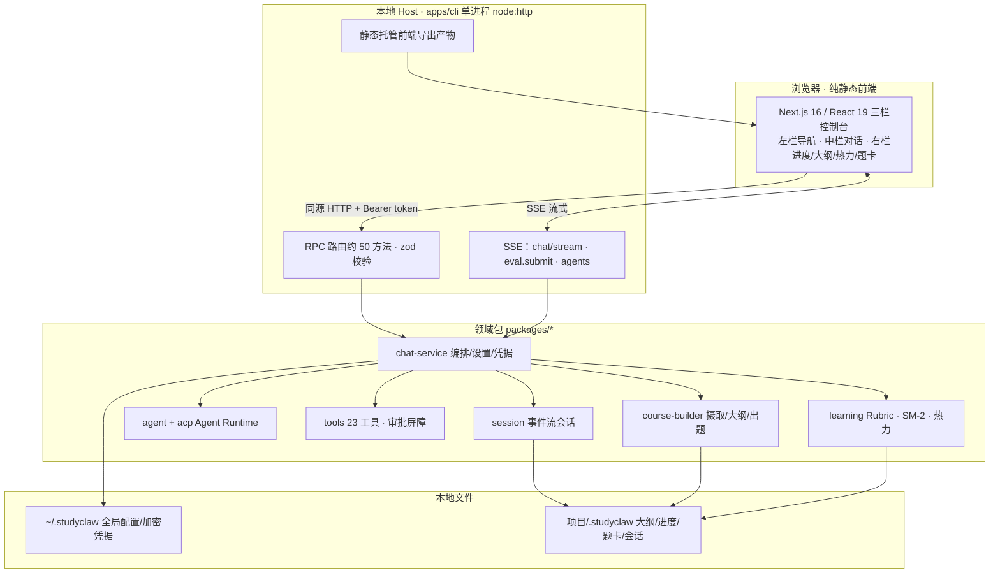

# StudyClaw

**本地优先的 AI 学习搭子 —— 把一个资料文件夹，变成会追问、会出题、会安排复习的私教。**


[快速开始](#快速开始)**&#x20;·&#x20;**[学习闭环](#学习闭环)**&#x20;·&#x20;**[架构](#架构)**&#x20;·&#x20;**[CLI 命令](#cli-命令参考)**&#x20;·&#x20;**[开发指南](#开发指南)**&#x20;·&#x20;**[路线图](#路线图)**&#x20;·&#x20;**[FAQ](#faq)


***

## 这是什么

StudyClaw 是一个跑在你自己电脑上的 AI 学习助手。给它一个装满课件、PDF、笔记、代码的文件夹，它会：


1. **读懂资料**，自动生成双层大纲与题卡任务池；

2. **陪你对话学习**，按你选择的教学模式追问、引导或冲刺；

3. **出题测验**，按采分点批改主观题、本地秒判选择题；

4. **用 SM-2 间隔重复算法安排复习**，并把掌握度、学习热力图回写到课程状态里。

整个过程**不依赖云账号、不建数据库、不做任何遥测**：课程状态就是你项目目录下的一组人类可读文件（Markdown / JSON / JSONL），AI 只连接你自己配置的模型端点。

> 与常见 AI 学习工具的区别
>

|      | 云端 AI 题库 / 课程 App | 通用 AI 聊天窗口 | **StudyClaw**             |
| ---- | ----------------- | ---------- | ------------------------- |
| 学习材料 | 平台预置，你的资料进不去      | 每次手动粘贴     | **直接挂载本地文件夹，增量更新**        |
| 学习状态 | 锁在平台账号里           | 对话关掉就没了    | **本地文件，可审计、可迁移**          |
| 复习机制 | 固定题库              | 无          | **SM-2 间隔重复 + 掌握度追踪**     |
| 模型   | 只能用平台的            | 自由但无学习结构   | **任意 OpenAI 兼容端点，你带 Key** |
| 数据隐私 | 上传到服务商            | 上传到模型厂商    | **仅请求模型时出站，其余全离线**        |


***

## 功能特性

### 学习闭环


* **多格式资料摄取**：PDF（pdf-parse）、Word（.docx，mammoth）、Excel（.xlsx，转 GFM 表格）、网页（.html/.htm，turndown）、Markdown、纯文本与各类源代码文件；统一转 Markdown 并做中文标题结构修复；按文件 SHA-256 增量识别，**改哪补哪，不重复构建**。

* **双层大纲 + 题卡任务池**：fine/coarse 两级章节结构，依赖推断（先修概念先学），结构化工具调用生成选择 / 填空 / 简答 / 代码题，带质量守卫与难度轮换。

* **四种教学模式**，同一套课程状态随时切换：


| 模式                        | 风格                          | 适用场景    |
| ------------------------- | --------------------------- | ------- |
| **苏格拉底&#x20;**`socratic`  | 不直接给答案，用线索、反例、边界条件反问引导      | 概念理解、纠偏 |
| **极速冲刺&#x20;**`quick`     | 一句话本质 + 3 个关键特征 + 避坑 + 最小示例 | 考前突击    |
| **费曼&#x20;**`feynman`     | 反客为主，让你讲、它挑刺追问暴露模糊点         | 输出式巩固   |
| **实战 Debug&#x20;**`debug` | 基于真实报错与边界场景，逐步给线索而非答案       | 编程 / 排障 |


* **双轨评测**：主观题走 Rubric 采分点命中（二元判定 + 苏格拉底式反馈，评测走专用快路由省 token）；选择题按 answer-key **本地零 LLM 秒判**。

* **SM-2 间隔重复**：掌握度 0\~1、通过阈值 0.6、难度因子 EF 钳制 \[1.3, 2.9]、经典 1/6/15… 天间隔；到期队列优先、抽卡零泄题；误区可触发生成动态变体卡。

* **可视化进度**：9 列 `progress.md`、掌握度指数平滑、日期驱动的学习热力图、大纲关系图（React Flow）与思维导图（Mind Elixir）双视图。

* **交互演示块**：AI 可在讲解中插入自包含的可交互 HTML 演示（沙箱 iframe + CSP 断网，无外部资源、无持久化）。

### Agent 能力


* **23 个工具**：13 个学习工具（读资料、查课程状态、题池、记忆、建卡、复习、测验、评测、写笔记等）+ 10 个通用工具（文件读写、命令执行、网页抓取、网络搜索、plan/todo、子 Agent、LSP）。

* **完整 Agent Runtime**：对齐主流编码 Agent 的 durable inbox（消息排队 / 插队 / 转向 / 注入）、turn/step 状态机、**工具审批队列**（allow/deny/cancel/ 超时全部持久化）、子 Agent、空闲维护任务；另支持 **ACP 协议**（NDJSON 流式，可接入兼容的 Agent 客户端）。

* **安全默认值**：写操作 / 命令执行需审批；审批通道缺失时 fail-closed 降级而不是裸奔；文件操作带 symlink 越界拒绝与课程文件锁。

### 本地优先与隐私


* **零遥测、零分析 SDK、零自动更新上报**；唯一的网络请求发往你配置的模型端点，以及你主动调用的搜索工具。

* API Key 使用 **AES-256-GCM 加密落盘**，主密钥与凭据分离存放（0600 权限、原子写入、旧明文自动迁移）。

* 本地服务默认只绑 `127.0.0.1`，启动随机 token、恒定时间比对、loopback Origin 白名单防跨站调用。

* **文件即状态**：不跑数据库服务，所有课程与会话数据是普通文本文件，断电可恢复、可 Git 管理、可人工审阅。

### 工程化


* TypeScript 全严格类型；pnpm monorepo（25 个内部包 + vendored cordis 基座）。

* **1000+ 测试用例**（单元 + 组件 + HTTP/SSE 集成），CI 含类型检查、双端测试、tsc 误发射守卫、以及「打包 → 真装 → 真跑」的发布门禁。

* 前端 Next.js 16 **纯静态导出**，由同一个 Node Host 托管，无需任何反向代理。


***

## 学习闭环




更多细节见 [docs/LEARNING\_FLOW.md](./docs/LEARNING_FLOW.md)（进程端口、导入构建、对话、评测复习、面板数据来源与端到端验收清单）。


***

## 架构





***

## 快速开始

### 环境要求


* **Node.js&#x20;**`^22.19.0`**&#x20;或&#x20;**`>=24`（用到了新版 Node 能力，Node 20 及以下不支持）

* **pnpm 11.7+**（推荐用 corepack 启用：`corepack enable`）

* Windows /macOS/ Linux 桌面均可（当前主力验证平台为 Windows，macOS/Linux 欢迎在 Issues 反馈）

### 方式一：从源码运行（当前推荐）


```
\# 1. 拉取并安装依赖

git clone \<your-repo-url> studyclaw && cd studyclaw

pnpm install

\# 2. 构建前端静态产物

pnpm build:web

\# 3. 启动本地 Host（默认 http://127.0.0.1:8080，自动打开浏览器）

pnpm serve --open
```

首次打开后，在 **设置 → 模型提供商** 中填入任意 OpenAI 兼容端点与 API Key 即可开始。内置预设：


* **DeepSeek 官方**（`https://api.deepseek.com`）

* **SenseNova 日日新**（商汤托管的 DeepSeek V4 Pro/Flash、SenseNova 6.8 Flash Lite 等）

* **OpenRouter**

* **自定义**：任何 OpenAI 兼容服务（vLLM / SGLang / Ollama 的 OpenAI 兼容层 / 其他网关），支持「发现模型」拉取模型列表

### 方式二：npm 全局安装

> 将随 
>
> `v0.1.0-beta`
>
>  发布到 npm（
>
> `@studyclaw/cli`
>
> ，单文件 Bundle、仅 koffi/pdf-parse 两个外部原生依赖）。发布后：
>

```
npm install -g @studyclaw/cli

studyclaw serve --open
```

### 五步上手


1. **新建工作区**：向导中选择一个本地文件夹作为课程项目（也可用系统原生目录选择对话框）。

2. **导入资料**：把课件放进该文件夹，在「素材」中触发同步。

3. **构建课程**：生成双层大纲与题卡任务池（增量构建，只处理变化的文件）。

4. **对话学习**：选教学模式开始提问；AI 通过工具读取课程状态，需要执行动作时会发起审批。

5. **测验复习**：右栏发起 quiz，批改结果驱动 SM-2 排期；到期卡片会在复习队列里等你。


***

## CLI 命令参考

Host 与命令行共用一个二进制 `studyclaw`：


| 命令                                                                                             | 作用                                        |
| ---------------------------------------------------------------------------------------------- | ----------------------------------------- |
| `serve [--port <n>] [--open] [--insecure-no-token]`                                            | 启动本地 Host + 静态托管（默认 8080；`--open` 自动开浏览器） |
| `status`                                                                                       | 查看 Host 与工作区状态                            |
| `sync [--course <id>]`                                                                         | 同步资料变更、增量重建                               |
| `quiz [count] [--mode new\|review] [--course <id>] [--concept <id>]`                           | 命令行抽题测验                                   |
| `review [count] [--course <id>] [--concept <id>]`                                              | 到期复习                                      |
| `chat [message] [--mode socratic\|quick\|feynman\|debug] [--new] [--turns N]`                  | 命令行单轮 / 多轮辅导                              |
| `session migrate [<sessionId>]`                                                                | 旧格式会话迁移                                   |
| `agent <create\|resume\|prompt\|send\|answer\|status\|cancel\|whenIdle\|maintenance\|dispose>` | Agent Runtime 操作                          |
| `approvals <list\|resolve>`                                                                    | 查看 / 处理待审批动作                              |
| `plan <get\|update>` / `todo <get\|update>`                                                    | 计划与待办                                     |
| `acp`                                                                                          | 以 ACP（NDJSON）协议模式运行                       |

### 数据存放位置


| 路径                                                  | 内容                                                                                                                |
| --------------------------------------------------- | ----------------------------------------------------------------------------------------------------------------- |
| `~/.studyclaw/`（Windows：`%USERPROFILE%\.studyclaw`） | 全局：`workspace.json` 注册表、`config.yaml`、加密的 `credentials.json`、`master.key`、`host.json`、`logs/`                     |
| `<项目>/.studyclaw/`                                  | 每门课程：`syllabus.json` 大纲、`progress.md` 进度、`tasks/task_NNNN.json` 题卡、`notes.md`、`history/` 会话流、`sources/.checksums` |


***

## 开发指南

### 开发模式（热更新，需要两个终端）


```
\# 终端 A：后端 Host（:8080）

pnpm serve

\# 终端 B：前端 dev server（:3000，/api/\* 自动反代到 8080）

cd apps/web && pnpm dev
```

### 常用脚本（仓库根目录）


| 脚本                                                         | 作用                         |
| ---------------------------------------------------------- | -------------------------- |
| `pnpm typecheck`                                           | 全 project references 图类型检查 |
| `pnpm test`                                                | 一条命令跑后端 + Web 全部测试         |
| `pnpm build:web`                                           | 前端静态导出到 `apps/web/out`     |
| `pnpm build`                                               | 全量构建                       |
| `pnpm release:pack` / `release:verify` / `release:publint` | 打包 / 真装验证 / 发布规范检查         |

> 慢机器（Windows + 机械盘）上若 
>
> `pnpm test`
>
>  出现 I/O 超时假红，改用
> `node_modules/.bin/vitest run --testTimeout=60000 --hookTimeout=60000`
>
> （CI 同口径，单测本身无失败）。

### 目录结构


```
studyclaw-next/

├── apps/

│   ├── cli/            # 本地 Host：HTTP/RPC/SSE、静态托管、全部 CLI 子命令

│   └── web/            # Next.js 静态导出控制台（三栏 UI + 状态层）

├── packages/

│   ├── session/        # JSONL 事件流会话、四模式提示词、流式分段

│   ├── agent/  acp/    # Agent Runtime 与 ACP 协议

│   ├── tools/          # 13 学习工具 + 10 通用工具、审批屏障

│   ├── course/         # builder：摄取/大纲/出题/质量守卫；summary：摘要

│   ├── learning/       # Rubric 评测、选卡、SM-2、热力聚合

│   ├── host/           # apiproxy（RPC 门面）、chat-service（编排）、原生目录选择

│   ├── llm/            # LLM 抽象与 OpenAI 兼容适配器（SSE/思考块/用量）

│   ├── storage/        # storage 域契约 + JSON 后端

│   └── settings/ credentials/ identity/ workspace/ attachment/ util/ …

├── vendor/             # vendored cordis 生态（MIT，见 THIRD\_PARTY\_NOTICES.md）

├── scripts/release/    # 打包、真装验证、publint

└── docs/LEARNING\_FLOW.md
```

### 工程约定


* 提交遵循 Conventional Commits（`feat/fix/chore…(scope): …`）。

* 改动领域契约（RPC 方法、文件格式、事件类型）时必须同步补测试；合入前 `pnpm typecheck` 零错误、`pnpm test` 全绿。

* 包之间通过明确的导出边界依赖，领域包不直接碰 HTTP 传输层；新增 RPC 方法需在 `apiproxy` 补 zod 校验与错误码。

* 学习状态一律走「文件即状态」契约（`syllabus.json` / `progress.md` / `tasks/` / `history/`），不引入数据库服务。


***

## 路线图


* [x] M0–M4：工作区注册表、课程构建、事件流会话、23 工具与审批、Agent Runtime（对齐 dsh）、三栏控制台、Rubric + SM-2 学习闭环

* [x] npm 打包链路：CLI 单 Bundle、静态托管、发布三道门禁、供应链 CVE 处理

* [x] 吉祥物 Clawzy、交互演示块、选择题本地快判、评测快路由

* [ ] **v0.1.0-beta**：跨平台真机验证（macOS/Linux）、社区 Issue 模板、浏览器级 E2E

* [ ] 桌面壳（Tauri/Electron sidecar，免装 Node）

* [ ] `studyclaw course` 顶层命令接线

* [ ] 国际化（i18n）与英文界面

* [ ] 可选的在线 / 多端同步形态（坚持端到端加密、本地优先不动摇）


***

## FAQ

**Q：会把我的资料或学习记录上传到哪里吗？**

A：不会。资料解析、课程状态、SM-2 调度全部在本地完成；只有对话 / 评测请求会发往你自己配置的模型端点。没有任何遥测。

**Q：必须用 DeepSeek 吗？**

A：不是。任何实现 OpenAI Chat Completions（含 SSE 流式）的端点都可以：官方 API、OpenRouter、vLLM/SGLang/Ollama 自托管、各类网关均可，在设置里添加即可，Key 加密保存在本机。

**Q：为什么要求 Node 22.19+？**

A：项目使用了较新的 Node 运行时能力，且在该版本线上完成测试。请使用 Node 22.19+ 或 Node 24+。

**Q：端口 8080 被占用怎么办？**

A：`studyclaw serve --port 18081`；Host 也会在 `~/.studyclaw/host.json` 记录实际端口与访问 token。

**Q：corepack/pnpm 在我机器上不可用？**

A：可直接用仓库内二进制，例如 `node_modules/.bin/tsx apps/cli/src/bin.ts serve`、`node_modules/.bin/vitest run`。

**Q：测试报超时失败？**

A：多为慢磁盘并发下的假红（非回归），按开发指南加 `--testTimeout=60000 --hookTimeout=60000` 即可全绿；单独跑该测试文件也必然通过。

**Q：数据文件可以手动看 / 改吗？**

A：可以，这是「文件即状态」的设计目标：`progress.md` 是纯 Markdown 表格，会话是 JSONL。改动前建议先备份；Host 运行时对课程文件有锁保护。


***

## 贡献

欢迎 Issue、PR 与试用反馈。开始之前建议先阅读：


* [docs/LEARNING\_FLOW.md](./docs/LEARNING_FLOW.md)：学习闭环数据流与各面板数据来源

* 上文「[架构](#架构)」「[开发指南](#开发指南)」两节：分层边界、目录结构与工程约定

* Issue 请尽量附上：操作系统、Node 版本、`studyclaw status` 输出、`~/.studyclaw/logs/` 相关日志与复现步骤

> 安全问题请不要直接开公开 Issue，优先私下联系维护者（详见后续补充的 SECURITY.md）。

## 致谢

StudyClaw next 站在巨人的肩膀上：


* [DeepSeek Harness (dsh)](https://github.com/deepseek-ai/deepseek-harness) 与其 vendored 的 [cordis](https://github.com/cordiverse) 生态（均为 MIT）：Agent/RPC/ 存储基座与大量工程范式，完整归属与本地修改清单见 [THIRD\_PARTY\_NOTICES.md](./THIRD_PARTY_NOTICES.md)。

* 文档解析管线依赖 [pdf-parse](https://www.npmjs.com/package/pdf-parse)、[mammoth.js](https://github.com/mwilliamson/mammoth.js)、[turndown](https://github.com/mixmark-io/turndown)、[SheetJS](https://sheetjs.com)；界面与体验得益于 [Next.js](https://nextjs.org)、[React Flow](https://reactflow.dev)、[mind-elixir](https://github.com/ssshooter/mind-elixir)、[koffi](https://github.com/Koromix/koffi)、[zod](https://zod.dev) 等开源项目。

## 许可证

[MIT](./LICENSE) © StudyClaw authors。第三方代码许可声明见 [THIRD\_PARTY\_NOTICES.md](./THIRD_PARTY_NOTICES.md)。